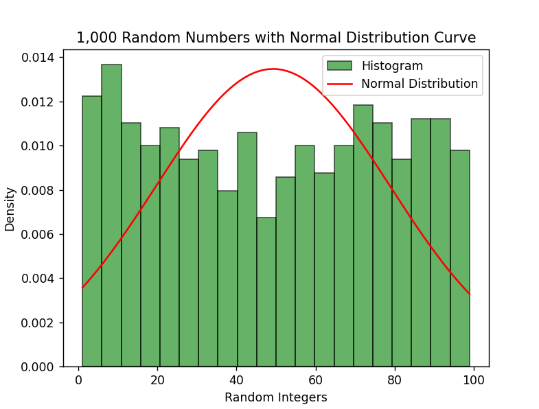
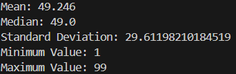

# COM4043-Assessment-1
## Imported Pictures

  
  

The distribution of the this particular graph is decidedly not symmetrical due to the lack of symmetry lines. Also, this presents a unique perspective as all of the graphs would be unique due to the random nature of how it's made. The mean for this graph is 49.246 whereas the median for this group is 49 which almost identical to the mean. this could be due to the max number being 100, however upon further reflection a max number of 10**6 also gives similar values. I have also noticed the graph is slightly skewed in favor of the lower and higher end of the numbers. This has affected the normal distribution completely as it is the total opposite of the Histograms readings distribution line .

